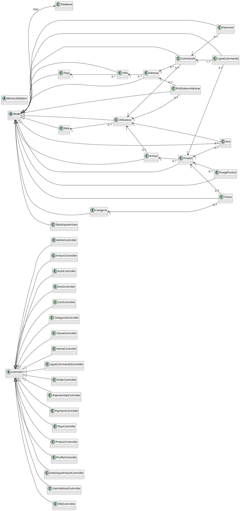
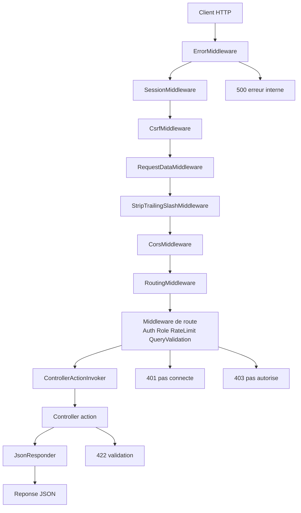

# Cahier technique backend + base de donnees (version TFE)

## 1. Introduction

Ce document presente le fonctionnement backend du projet marketplace de maniere pedagogique.
L'objectif est de decrire simplement mais precisement:
- comment une requete est traitee,
- comment Slim est utilise,
- quels sont les chemins API disponibles,
- quelles securites sont appliquees,
- comment la base de donnees est structuree.

Ce document est complementaire de la version technique detaillee:
- docs/cahier-technique-backend-db.md

## 2. Vue d'ensemble de l'architecture

Le backend repose sur une architecture MVC legere autour de Slim 4:
- Front controller: public/index.php
- Bootstrap applicatif: app/bootstrap.php
- Routing central: app/config/routes.php
- Controleurs metier: app/controllers/
- Modeles + validation: app/models/
- Noyau technique: app/core/
- Securite dediee: app/security/
- Middlewares transverses: app/middleware/

### 2.1 Pourquoi Slim dans ce projet

Slim est utilise comme moteur HTTP.
Il apporte:
- la gestion des routes,
- la pile de middlewares,
- la normalisation Request/Response (PSR-7),
- la gestion des erreurs centralisee.

Concretement, Slim orchestre le cycle complet d'une requete entrante jusqu'a la reponse JSON finale.

## 2.2 Diagramme UML des classes backend

Cette vue resume l'architecture objet du backend. Elle est volontairement plus compacte que la version technique detaillee, mais elle conserve les cardinalites utiles a la lecture.

### 2.2.1 Vue simplifiee avec cardinalites

```mermaid
classDiagram
direction LR

abstract class Controller
class AdminController
class ArtisanController
class AuthController
class AvisController
class CartController
class CategorieController
class ClasseController
class HomeController
class LigneCommandeController
class OrderController
class PaiementApiController
class PaymentController
class PaysController
class ProductController
class ProfileController
class StatistiqueArtisanController
class UserAddressController
class VilleController

Controller <|-- AdminController
Controller <|-- ArtisanController
Controller <|-- AuthController
Controller <|-- AvisController
Controller <|-- CartController
Controller <|-- CategorieController
Controller <|-- ClasseController
Controller <|-- HomeController
Controller <|-- LigneCommandeController
Controller <|-- OrderController
Controller <|-- PaiementApiController
Controller <|-- PaymentController
Controller <|-- PaysController
Controller <|-- ProductController
Controller <|-- ProfileController
Controller <|-- StatistiqueArtisanController
Controller <|-- UserAddressController
Controller <|-- VilleController

abstract class Model
class Database
Model --> Database : PDO

abstract class AbstractValidator
class Utilisateur
class Role
class Artisan
class Produit
class Commande
class LigneCommande
class Paiement
class Adresse
class Ville
class Pays
class Avis
class ImageProduit
class Categorie
class Classe
class RUtilisateurAdresse
class StatistiqueArtisan

Model <|-- Utilisateur
Model <|-- Role
Model <|-- Artisan
Model <|-- Produit
Model <|-- Commande
Model <|-- LigneCommande
Model <|-- Paiement
Model <|-- Adresse
Model <|-- Ville
Model <|-- Pays
Model <|-- Avis
Model <|-- ImageProduit
Model <|-- Categorie
Model <|-- Classe
Model <|-- RUtilisateurAdresse
Model <|-- StatistiqueArtisan

Role "1" <-- "0..*" Utilisateur
Utilisateur "1" <-- "0..1" Artisan
Utilisateur "1" <-- "0..*" Commande
Utilisateur "1" <-- "0..*" Avis
Artisan "1" <-- "0..*" Produit
Produit "1" <-- "0..*" LigneCommande
Commande "1" <-- "1..*" LigneCommande
Commande "1" <-- "0..1" Paiement
Produit "1" <-- "0..*" Avis
Produit "1" <-- "0..*" ImageProduit
Adresse "1" <-- "0..*" Commande
Ville "1" <-- "0..*" Adresse
Pays "1" <-- "0..*" Ville
Categorie "1" <-- "0..*" Classe
Produit "1" <-- "0..*" Classe
Utilisateur "1" <-- "0..*" RUtilisateurAdresse
Adresse "1" <-- "0..*" RUtilisateurAdresse
```

### 2.2.2 Version PlantUML directement exploitable



### 2.2.3 Fonctions clefs a retenir

Pour l'expose, il suffit souvent de retenir les groupes de fonctions suivants:

| Bloc | Fonctions principales |
|---|---|
| Controller | `respond(...)`, `consumeResponse()` |
| AuthController | `loginForm()`, `login()`, `logout()`, `registerForm()`, `register()` |
| ProductController | `index()`, `show()`, `indexByArtisan()`, `store()`, `update()`, `destroy()` |
| OrderController | `index()`, `show()`, `store()` |
| AdminController | `users()`, `artisans()`, `products()`, `orders()`, `categories()`, `stats()` |
| Model | `all()`, `find()`, `where()`, `create()`, `update()`, `delete()`, `save()` |
| Validators | `validate()`, et `validateLogin()` pour `UtilisateurValidator` |

La version detaillee contenant l'inventaire complet des fonctions reste dans `docs/cahier-technique-backend-db.md`.

## 3. Chemin complet d'une requete

Exemple: POST /project02/api/avis

1. Le client envoie la requete HTTP.
2. public/index.php charge app/bootstrap.php puis lance app->run().
3. Slim applique les middlewares globaux.
4. Slim matche la route dans app/config/routes.php.
5. Les middlewares de route (auth/role/rate-limit) sont appliques si necessaire.
6. Le ControllerActionInvoker appelle le controleur cible.
7. Le controleur applique la logique metier et utilise les modeles.
8. Le modele valide les donnees et execute les requetes SQL via PDO.
9. JsonResponder construit la reponse JSON PSR-7.
10. Les logs sont enrichis selon le statut et le contexte.

### 3.1 Schema simple de la chaine middleware (version debutant)

Pour visualiser simplement, la requete passe par cette chaine:

Client HTTP
-> ErrorMiddleware
-> SessionMiddleware
-> CsrfMiddleware
-> RequestDataMiddleware
-> StripTrailingSlashMiddleware
-> CorsMiddleware
-> RoutingMiddleware
-> Middleware(s) de route (Auth/Role/RateLimit/QueryValidation selon endpoint)
-> ControllerActionInvoker
-> Controller@action
-> JsonResponder
-> Reponse JSON

Lecture rapide:
- 401: pas connecte
- 403: connecte mais pas autorise
- 422: donnees invalides
- 500: erreur interne

Diagramme Mermaid:



## 4. Role des composants centraux

## 4.1 app/core

- BasePathResolver: detecte le prefixe d'URL (ex: /project02).
- ControllerActionInvoker: lien entre une route Controller@action et son execution reelle, avec preservation des headers natifs (dont Set-Cookie) dans la reponse PSR-7.
- JsonResponder: normalise toutes les sorties JSON.
- AppLogger: journalise les evenements applicatifs avec rotation de logs.

## 4.2 app/middleware

- SessionMiddleware: initialise la session de facon securisee.
- CorsMiddleware: gere CORS et preflight OPTIONS.
- StripTrailingSlashMiddleware: retire les slashs finaux imposes par Apache avant le matching des routes.
- RequestDataMiddleware: parse les corps JSON/form-data en entree.
- AuthMiddleware: bloque les routes protegees pour les non connectes.
- RoleMiddleware: bloque les routes non autorisees par role.
- QueryValidationMiddleware: valide les query params des routes filtrees (whitelist + types + contraintes).

## 4.3 app/security

- SessionSecurity: politique cookies/session (strict mode, httponly, samesite).
- CsrfTokenManager + CsrfMiddleware: protection CSRF.
- LoginRateLimitMiddleware: limitation des tentatives de connexion.
- OwnershipGuard: verification des droits proprietaire/admin sur les ressources.
- AuthContext: extraction du contexte utilisateur depuis la session.

## 5. Gestion des routes et des chemins API

Le registre principal est:
- app/config/routes.php

Le base path applicatif est configure a:
- /project02

Exemples de chemins complets:
- GET /project02/
- POST /project02/login
- GET /project02/products
- POST /project02/orders
- GET /project02/api/pays
- POST /project02/api/avis

La strategie de securisation des routes est explicite dans la declaration:
- route publique (sans middleware),
- route authentifiee (AuthMiddleware),
- route restreinte par role (RoleMiddleware),
- route filtree avec validation stricte des query params (QueryValidationMiddleware),
- route sensible avec controle metier (ownership dans les controleurs).

## 6. Securite backend mise en place

## 6.1 Authentification et autorisation

- Authentification par session.
- Role utilisateur en session (admin, artisan, client).
- Register securise: le role n'est plus choisi librement par le client.

## 6.2 CSRF

- Token CSRF stocke en session.
- Verification sur requetes mutantes authentifiees.
- Header X-CSRF-Token expose pour le frontend Angular.

## 6.3 Rate limiting

- Rate limit applique sur POST /login.
- Fenetre glissante avec configuration par variables d'environnement.

## 6.4 Protection ownership (BOLA/IDOR)

- Paiements: acces reserve au proprietaire de la commande ou admin.
- Lignes de commande: meme regle.
- Avis: modification/suppression reservee a l'auteur ou admin.

## 6.5 Validation metier

- Chaque modele peut declarer un validator dedie.
- Les erreurs de validation sont captees et renvoyees proprement (422).

## 6.6 Validation des query params

Un middleware dedie est applique sur certains endpoints GET sensibles (paiement et statistiques) pour eviter les parametres inattendus.

Le middleware applique:
- whitelist des cles query autorisees
- typage (`int`, `date`, `string`)
- contraintes de presence (`required`) et bornes
- regle de coherence de plage de dates (`date_debut <= date_fin`)

En cas d'echec, la reponse est un 400 JSON explicite.

## 6.7 Correlation ID et logs dedies

Pour faciliter le debug transverse:
- lecture de `X-Correlation-Id` si fourni (sinon generation backend)
- renvoi de `X-Correlation-Id` dans la reponse
- journalisation dediee des rejets query dans `app/logs/query-validation-attempts.log`

## 6.8 Normalisation des chemins

En production, Apache peut rediriger automatiquement une URL comme `/products` vers `/products/`.

Pour eviter que ce changement casse les routes Slim, le backend applique `StripTrailingSlashMiddleware`, qui retire le slash final avant le routage.

Effet pratique:
- les routes publiques continuent a fonctionner meme si le serveur ajoute un slash final
- cela evite des erreurs artificielles sur les pages catalogue, artisans ou categories

## 6.9 Logs et tracabilite

Dossier:
- app/logs

Canaux principaux:
- app-error.log
- client-error.log
- validation.log
- security.log
- access.log
- rate-limit.log
- php-error.log
- query-validation-attempts.log

## 6.10 Verification E2E

Le script `test/api-checklist.ps1` valide les parcours critiques (anonyme, client, artisan, admin) et sert de garde-fou apres les changements de securite.

Precondition pratique:
- utiliser les comptes seeds documentes dans docs/comptes-seed.md.

Rotation simple:
- seuil configurable (APP_LOG_MAX_BYTES),
- bascule vers suffixe .1.

## 7. Base de donnees: structure et logique

Schema principal:
- sql/Script SQL.sql

Tables coeur:
- role, utilisateur
- pays, ville, adresse
- artisan, categorie, produit, image_produit
- commande, ligne_commande, paiement
- avis, statistique_artisan
- r_utilisateur_adresse, classe

Relations importantes:
- utilisateur -> role
- artisan -> utilisateur
- produit -> artisan
- commande -> utilisateur + adresse
- ligne_commande -> commande + produit
- paiement -> commande
- avis -> utilisateur + produit
- classe -> categorie + produit

Contraintes cle:
- email utilisateur unique
- reference commande unique
- cles composites sur les tables de liaison

## 8. Scripts SQL et cycle de preparation

1. sql/Script SQL.sql: creation du schema.
2. sql/SeedDataClone.sql: donnees de reference + tests.
3. sql/SeedSpecializedCatalog.sql: enrichissement catalogue.
4. sql/MigrateLegacyCatalog.sql: migration legacy -> nouveau catalogue.
5. sql/SetupCloneDatabase.sql: reinit complete locale.
6. sql/SetupCloneDatabase.production.sql: variante orientee production.

## 9. Exemple pedagogique: route home

Route:
- GET /project02/
- Handler: HomeController@index

Comportement:
1. La route est matchee dans routes.php.
2. L'invoker appelle HomeController@index.
3. Le controleur utilise respond(...).
4. JsonResponder renvoie une reponse JSON standard.

Ce flux montre la philosophie du projet: une API JSON uniforme, avec un pipeline HTTP clair.

## 10. Conclusion

Le backend du projet est structure autour d'un pipeline Slim propre, d'une separation claire des responsabilites et d'une securisation pragmatique:
- middlewares transverses,
- securite dediee en app/security,
- controle metier dans les controleurs,
- validation au niveau modele,
- logs exploitables en production.

Cette base est suffisamment robuste pour un contexte TFE: elle est lisible, evolutive et testable, tout en restant simple a expliquer a l'oral.
