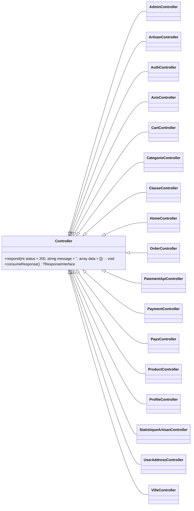
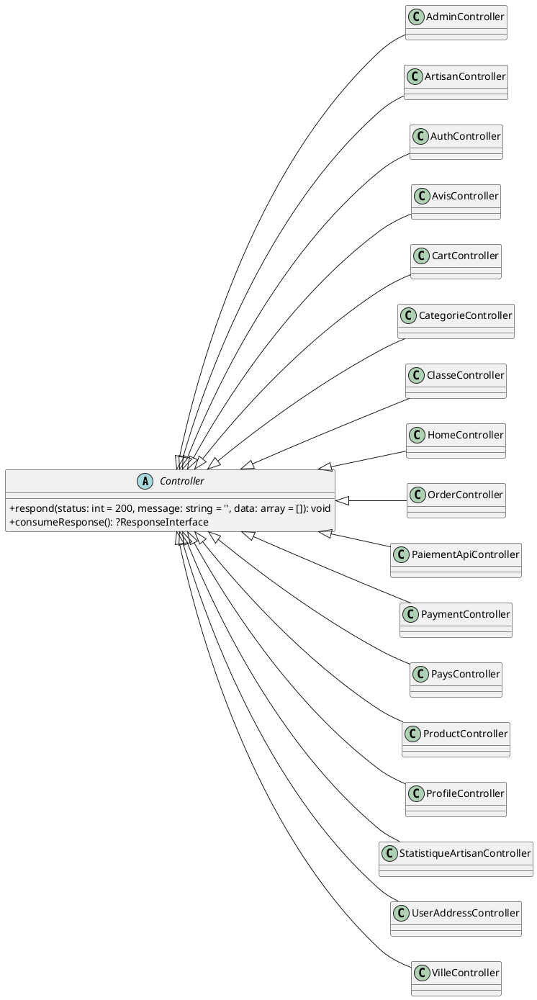
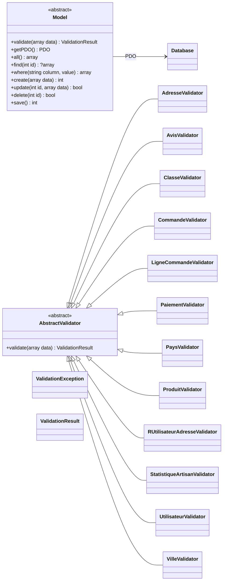
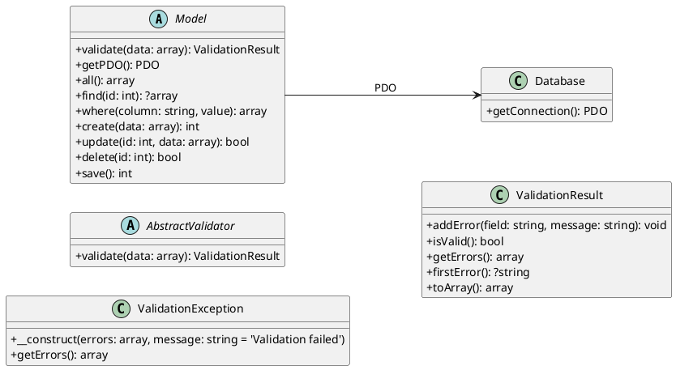
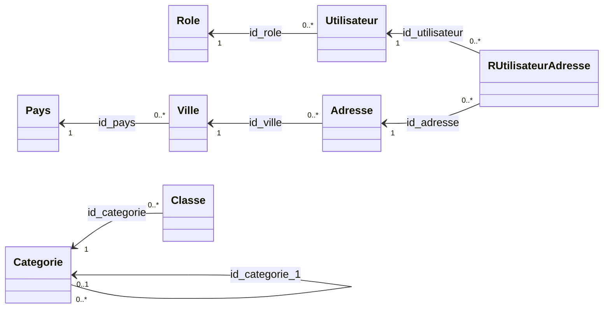
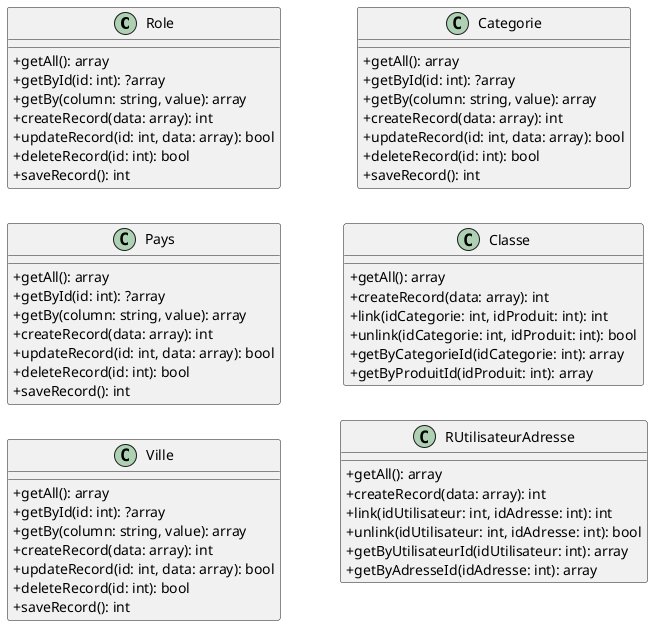
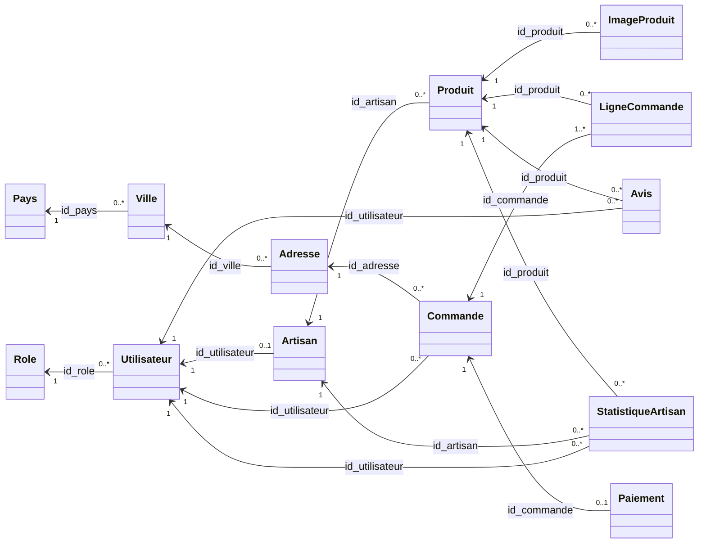
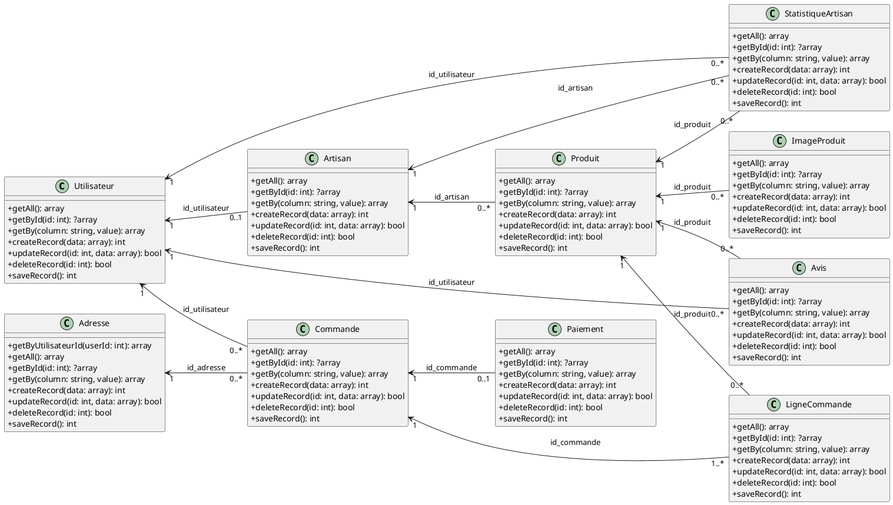
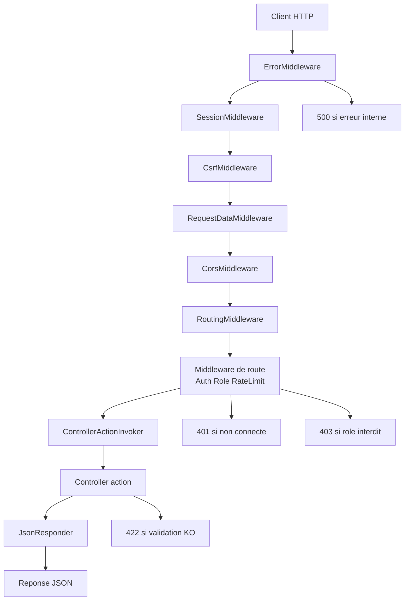

# Cahier technique backend + base de donnees

## 1. Objet du document

Ce document decrit le comportement technique du backend et de la base de donnees du projet marketplace.
Il couvre:
- le chemin complet d'une requete HTTP,
- le role de Slim et des middlewares,
- la cartographie des endpoints,
- les mecanismes de securite mis en place,
- la structure SQL et les scripts de preparation de donnees.

Perimetre fichiers:
- d:/Drive/#ECI/Projet d'integration de developpement/projet02/marketplace/app
- d:/Drive/#ECI/Projet d'integration de developpement/projet02/marketplace/public
- d:/Drive/#ECI/Projet d'integration de developpement/projet02/marketplace/sql
- d:/Drive/#ECI/Projet d'integration de developpement/projet02/marketplace/test

## 2. Stack technique backend

- Framework HTTP: Slim 4
- Standard requete/reponse: PSR-7 via slim/psr7
- Langage: PHP
- Acces DB: PDO (MySQL/MariaDB)
- Routing: declaration centralisee dans app/config/routes.php
- JSON API: App/Core/JsonResponder.php
- Point d'entree HTTP unique: public/index.php

Dependances composer:
- slim/slim 4.x
- slim/psr7 ^1.8

## 2.1 Diagramme UML des classes backend

Le backend est decoupe en quatre blocs pour garder une lecture fluide:
- controleurs applicatifs,
- socle technique et validation,
- modeles de referentiel,
- modeles metier et commerce.

Les tableaux ci-dessous inventorient les fonctions visibles dans chaque classe, puis un bloc PlantUML compact permet de regenerer le diagramme par section.

### 2.1.1 Controleurs applicatifs

| Classe | Fonctions visibles |
|---|---|
| Controller | `respond(int $status = 200, string $message = '', array $data = []): void`, `consumeResponse(): ?ResponseInterface` |
| AdminController | `users()`, `showUser(int $id)`, `updateUser(int $id)`, `deactivateUser(int $id)`, `artisans()`, `showArtisan(int $id)`, `updateArtisan(int $id)`, `deactivateArtisan(int $id)`, `products()`, `updateProduct(int $id)`, `deactivateProduct(int $id)`, `orders()`, `showOrder(int $id)`, `updateOrder(int $id)`, `categories()`, `updateCategory(int $id)`, `updateCategoriesBulk()`, `updateAllCategories()`, `stats()`, `requireAdmin(): bool` |
| ArtisanController | `index()`, `show(int $id)`, `myProducts()`, `stats()`, `dashboard()`, `orders()`, `buildStrictArtisanOrders(int $artisanId, array $filters): array`, `buildArtisanStats(int $artisanId, array $filters): array`, `requireRole(int $role): int|false` |
| AuthController | `__construct()`, `loginForm()`, `login()`, `logout()`, `registerForm()`, `register()` |
| AvisController | `index()`, `show(int $id)`, `indexByProduit(int $idProduit)`, `store()`, `update(int $id)`, `destroy(int $id)` |
| CartController | `index()`, `add()`, `updateLine(int $idProduit)`, `remove(int $idProduit)`, `startSession(): void` |
| CategorieController | `index()`, `show(array $args)` |
| ClasseController | `index()`, `indexByCategorie(int $idCategorie)`, `indexByProduit(int $idProduit)`, `store()`, `destroy(int $idCategorie, int $idProduit)` |
| HomeController | `index()` |
| OrderController | `index()`, `show(int $id)`, `store()` |
| PaiementApiController | `index()`, `show(int $id)`, `store()`, `update(int $id)`, `destroy(int $id)` |
| PaymentController | `page()`, `process()`, `getPrimaryKey(): string` |
| PaysController | `index()`, `show(int $id)`, `store()`, `update(int $id)`, `destroy(int $id)` |
| ProductController | `index()`, `show(int $id)`, `indexByArtisan(int $artisan_id)`, `store()`, `update(int $id)`, `destroy(int $id)`, `withCategories(array $products): array`, `withCategory(array $product): array`, `slugifyCategory(string $label): string`, `requireAuth(): bool`, `requireRole(array $allowedRoles): bool`, `requireOwnerOrAdmin(int $artisanId): bool`, `isAdmin(): bool` |
| ProfileController | `show()`, `update()`, `deactivate()`, `requireAuth(): int|false` |
| StatistiqueArtisanController | `index()`, `show(int $id)`, `indexByArtisan(int $idArtisan)`, `store()`, `update(int $id)`, `destroy(int $id)`, `requireAdmin(): bool`, `requireSessionUser(): array|false` |
| UserAddressController | `index()`, `indexByUtilisateur(int $idUtilisateur)`, `indexByAdresse(int $idAdresse)`, `store()`, `destroy(int $idUtilisateur, int $idAdresse)`, `requireSessionUser(): array|false` |
| VilleController | `index()`, `show(int $id)`, `store()`, `update(int $id)`, `destroy(int $id)` |

### 2.1.2 Socle technique et validation

| Classe | Fonctions visibles |
|---|---|
| Model | `normalizeRow(array $row): array`, `getValidatorClass(): ?string`, `validateData(array $data): ValidationResult`, `validate(array $data): ValidationResult`, `sanitizeValue($value)`, `sanitizeData(array $data): array`, `__construct(array $attributes = [])`, `fill(array $attributes): self`, `__get(string $name)`, `__set(string $name, $value): void`, `toArray(): array`, `getPDO(): PDO`, `all(): array`, `find(int $id): ?array`, `where(string $column, $value): array`, `create(array $data): int`, `update(int $id, array $data): bool`, `delete(int $id): bool`, `save(): int` |
| Database | `getConnection(): PDO` |
| AbstractValidator | `__construct()`, `validate(array $data): ValidationResult` |
| ValidationException | `__construct(array $errors, string $message = 'Validation failed')`, `getErrors(): array` |
| ValidationResult | `addError(string $field, string $message): void`, `isValid(): bool`, `getErrors(): array`, `firstError(): ?string`, `toArray(): array` |
| AdresseValidator | `validate(array $data): ValidationResult` |
| AvisValidator | `validate(array $data): ValidationResult` |
| ClasseValidator | `validate(array $data): ValidationResult` |
| CommandeValidator | `validate(array $data): ValidationResult` |
| LigneCommandeValidator | `validate(array $data): ValidationResult` |
| PaiementValidator | `validate(array $data): ValidationResult` |
| PaysValidator | `validate(array $data): ValidationResult` |
| ProduitValidator | `validate(array $data): ValidationResult` |
| RUtilisateurAdresseValidator | `validate(array $data): ValidationResult` |
| StatistiqueArtisanValidator | `validate(array $data): ValidationResult` |
| UtilisateurValidator | `validate(array $data): ValidationResult`, `validateLogin(array $data): ValidationResult` |
| VilleValidator | `validate(array $data): ValidationResult` |

### 2.1.3 Modeles de referentiel

| Classe | Fonctions visibles |
|---|---|
| Role | `getAll()`, `getById(int $id)`, `getBy(string $column, $value)`, `createRecord(array $data)`, `updateRecord(int $id, array $data)`, `deleteRecord(int $id)`, `saveRecord()` |
| Pays | `getAll()`, `getById(int $id)`, `getBy(string $column, $value)`, `createRecord(array $data)`, `updateRecord(int $id, array $data)`, `deleteRecord(int $id)`, `saveRecord()` |
| Ville | `getAll()`, `getById(int $id)`, `getBy(string $column, $value)`, `createRecord(array $data)`, `updateRecord(int $id, array $data)`, `deleteRecord(int $id)`, `saveRecord()` |
| Categorie | `getAll()`, `getById(int $id)`, `getBy(string $column, $value)`, `createRecord(array $data)`, `updateRecord(int $id, array $data)`, `deleteRecord(int $id)`, `saveRecord()` |
| Classe | `getAll()`, `createRecord(array $data)`, `link(int $idCategorie, int $idProduit)`, `unlink(int $idCategorie, int $idProduit)`, `getByCategorieId(int $idCategorie)`, `getByProduitId(int $idProduit)` |
| RUtilisateurAdresse | `getAll()`, `createRecord(array $data)`, `link(int $idUtilisateur, int $idAdresse)`, `unlink(int $idUtilisateur, int $idAdresse)`, `getByUtilisateurId(int $idUtilisateur)`, `getByAdresseId(int $idAdresse)` |

### 2.1.4 Modeles metier et commerce

| Classe | Fonctions visibles |
|---|---|
| Utilisateur | `getAll()`, `getById(int $id)`, `getBy(string $column, $value)`, `createRecord(array $data)`, `updateRecord(int $id, array $data)`, `deleteRecord(int $id)`, `saveRecord()` |
| Artisan | `getAll()`, `getById(int $id)`, `getBy(string $column, $value)`, `createRecord(array $data)`, `updateRecord(int $id, array $data)`, `deleteRecord(int $id)`, `saveRecord()` |
| Produit | `getAll()`, `getById(int $id)`, `getBy(string $column, $value)`, `createRecord(array $data)`, `updateRecord(int $id, array $data)`, `deleteRecord(int $id)`, `saveRecord()` |
| ImageProduit | `getAll()`, `getById(int $id)`, `getBy(string $column, $value)`, `createRecord(array $data)`, `updateRecord(int $id, array $data)`, `deleteRecord(int $id)`, `saveRecord()` |
| Commande | `getAll()`, `getById(int $id)`, `getBy(string $column, $value)`, `createRecord(array $data)`, `updateRecord(int $id, array $data)`, `deleteRecord(int $id)`, `saveRecord()` |
| LigneCommande | `getAll()`, `getById(int $id)`, `getBy(string $column, $value)`, `createRecord(array $data)`, `updateRecord(int $id, array $data)`, `deleteRecord(int $id)`, `saveRecord()` |
| Paiement | `getAll()`, `getById(int $id)`, `getBy(string $column, $value)`, `createRecord(array $data)`, `updateRecord(int $id, array $data)`, `deleteRecord(int $id)`, `saveRecord()` |
| Avis | `getAll()`, `getById(int $id)`, `getBy(string $column, $value)`, `createRecord(array $data)`, `updateRecord(int $id, array $data)`, `deleteRecord(int $id)`, `saveRecord()` |
| Adresse | `getByUtilisateurId(int $userId)`, `getAll()`, `getById(int $id)`, `getBy(string $column, $value)`, `createRecord(array $data)`, `updateRecord(int $id, array $data)`, `deleteRecord(int $id)`, `saveRecord()` |
| StatistiqueArtisan | `getAll()`, `getById(int $id)`, `getBy(string $column, $value)`, `createRecord(array $data)`, `updateRecord(int $id, array $data)`, `deleteRecord(int $id)`, `saveRecord()` |

## 3. Architecture de l'execution HTTP

### 3.1 Front controller

- Fichier: public/index.php
- Action: charge app/bootstrap.php puis execute app->run().

### 3.2 Bootstrap

- Fichier: app/bootstrap.php
- Actions:
1. Charge la configuration app/config/app.php.
2. Cree l'application Slim.
3. Resout le base path via App/Core/BasePathResolver.php.
4. Enregistre les middlewares globaux.
5. Enregistre le gestionnaire d'erreurs global JSON.
6. Charge les routes depuis app/config/routes.php.

### 3.3 Ordre des middlewares (effectif)

Slim execute les middlewares en LIFO (dernier ajoute = premier execute).

Ajouts dans le bootstrap:
1. addRoutingMiddleware()
2. CorsMiddleware
3. RequestDataMiddleware
4. CsrfMiddleware
5. SessionMiddleware
6. ErrorMiddleware

Execution entrante (du plus externe au plus interne):
1. ErrorMiddleware
2. SessionMiddleware
3. CsrfMiddleware
4. RequestDataMiddleware
5. CorsMiddleware
6. RoutingMiddleware
7. Middlewares de route (Auth/Role/RateLimit selon endpoint)
8. ControllerActionInvoker
9. Controller@action

Execution sortante: ordre inverse.

### 3.3.1 Schema simple pour neophyte

Pensez la requete comme un passage par des controles successifs:

Client HTTP
-> ErrorMiddleware (capture les erreurs)
-> SessionMiddleware (ouvre/secure la session)
-> CsrfMiddleware (verifie token CSRF sur actions sensibles)
-> RequestDataMiddleware (lit et normalise les donnees)
-> CorsMiddleware (autorise l'origine frontend)
-> RoutingMiddleware (trouve la bonne route)
-> Middleware(s) de route (Auth/Role/RateLimit selon endpoint)
-> ControllerActionInvoker
-> Controller@action
-> JsonResponder
-> Reponse JSON au client

Memo court:
- Non connecte sur une route protegee => 401
- Role insuffisant => 403
- Donnees invalides => 422
- Erreur serveur => 500

Diagramme Mermaid:

### 3.4 Dispatch controller

- Fichier: app/core/ControllerActionInvoker.php
- Role:
1. Convertit la cible texte Controller@action en appel concret.
2. Execute la methode de controleur.
3. Reconcile sortie legacy avec reponse PSR-7.
4. Retourne une ResponseInterface a Slim.

### 3.5 Reponse JSON

- Fichier: app/core/JsonResponder.php
- Role: ecrire un payload JSON, fixer status HTTP et Content-Type.
- Utilisation:
1. Reponses controleurs via la base Controller.
2. Reponses d'erreur middleware et securite.

## 4. Roles des dossiers backend

## 4.1 app/core

- BasePathResolver.php: calcule le prefixe URL d'execution (/project02, etc.).
- ControllerActionInvoker.php: point de convergence technique des handlers de routes.
- JsonResponder.php: helper uniforme de reponse JSON PSR-7.
- AppLogger.php: journalisation JSONL dans app/logs avec rotation .1.

## 4.2 app/middleware

- SessionMiddleware.php: demarre et durcit la session selon config.
- CorsMiddleware.php: gere CORS et preflight OPTIONS.
- RequestDataMiddleware.php: parse JSON/form et remplit parsedBody/$_POST.
- AuthMiddleware.php: refuse si utilisateur non authentifie.
- RoleMiddleware.php: refuse si role non autorise.

## 4.3 app/security

Sous-ensemble securite factorise en fichiers independants:

- SessionSecurity.php: politique session/cookies (strict mode, httponly, samesite, etc.).
- CsrfTokenManager.php: generation/validation du token CSRF en session.
- middleware/CsrfMiddleware.php: enforcement CSRF sur requetes mutantes authentifiees.
- middleware/LoginRateLimitMiddleware.php: limite les tentatives de login (IP+email).
- middleware/AbstractSecurityMiddleware.php: base commune des refus securite + logs.
- ratelimit/SlidingWindowLimiter.php: logique fenetre glissante.
- authorization/OwnershipGuard.php: regles d'access control par proprietaire metier.
- auth/AuthContext.php: contexte utilisateur courant depuis la session.

## 5. Chemins complets des endpoints

Base path applicatif configure: /project02

Exemple URL complete locale:
- http://localhost/project02/login
- http://localhost/project02/api/pays

### 5.1 Public

- GET /project02/
- GET /project02/login
- POST /project02/login
- GET /project02/register
- POST /project02/register
- GET /project02/artisans
- GET /project02/artisans/{id}
- GET /project02/products
- GET /project02/products/{id}
- GET /project02/artisans/{artisan_id}/products
- GET /project02/cart
- POST /project02/cart
- PUT /project02/cart/{id_produit}
- DELETE /project02/cart/{id_produit}

### 5.2 Authentifie

- POST /project02/logout
- GET /project02/payment
- POST /project02/payment/process
- GET /project02/profile
- PUT /project02/profile
- DELETE /project02/profile

### 5.3 Client

- GET /project02/orders
- GET /project02/orders/{id}
- POST /project02/orders

### 5.4 Artisan

- GET /project02/artisan/products
- GET /project02/artisan/stats
- POST /project02/products
- PUT /project02/products/{id}
- DELETE /project02/products/{id}
- GET /project02/api/artisans/{id_artisan}/statistiques

### 5.5 Admin

- GET /project02/admin/users
- GET /project02/admin/users/{id}
- PUT /project02/admin/users/{id}
- DELETE /project02/admin/users/{id}
- GET /project02/admin/artisans
- GET /project02/admin/artisans/{id}
- PUT /project02/admin/artisans/{id}
- DELETE /project02/admin/artisans/{id}
- GET /project02/admin/products
- PUT /project02/admin/products/{id}
- DELETE /project02/admin/products/{id}
- GET /project02/admin/stats

### 5.6 API referentiels

- GET /project02/api/pays
- GET /project02/api/pays/{id}
- POST /project02/api/pays (admin)
- PUT /project02/api/pays/{id} (admin)
- DELETE /project02/api/pays/{id} (admin)

- GET /project02/api/villes
- GET /project02/api/villes/{id}
- POST /project02/api/villes (admin)
- PUT /project02/api/villes/{id} (admin)
- DELETE /project02/api/villes/{id} (admin)

### 5.7 API avis

- GET /project02/api/avis
- GET /project02/api/avis/{id}
- GET /project02/api/produits/{id_produit}/avis
- POST /project02/api/avis (auth)
- PUT /project02/api/avis/{id} (auth + ownership/admin)
- DELETE /project02/api/avis/{id} (auth + ownership/admin)

### 5.8 API paiements

- GET /project02/api/paiements (auth + ownership/admin)
- GET /project02/api/paiements/{id} (auth + ownership/admin)
- POST /project02/api/paiements (auth + ownership/admin)
- PUT /project02/api/paiements/{id} (auth + ownership/admin)
- DELETE /project02/api/paiements/{id} (auth + ownership/admin)

### 5.9 API classes (jointure categorie-produit)

- GET /project02/api/classes
- GET /project02/api/categories/{id_categorie}/classes
- GET /project02/api/produits/{id_produit}/classes
- POST /project02/api/classes (admin)
- DELETE /project02/api/classes/{id_categorie}/{id_produit} (admin)

### 5.10 API adresses utilisateur

- GET /project02/api/user-addresses (auth)
- GET /project02/api/utilisateurs/{id_utilisateur}/adresses (auth)
- GET /project02/api/adresses/{id_adresse}/utilisateurs (admin)
- POST /project02/api/user-addresses (auth)
- DELETE /project02/api/user-addresses/{id_utilisateur}/{id_adresse} (auth)

### 5.11 API lignes de commande

- GET /project02/api/lignes-commandes (auth + ownership/admin)
- GET /project02/api/lignes-commandes/{id} (auth + ownership/admin)
- GET /project02/api/commandes/{id_commande}/lignes (auth + ownership/admin)
- POST /project02/api/lignes-commandes (auth + ownership/admin)
- PUT /project02/api/lignes-commandes/{id} (auth + ownership/admin)
- DELETE /project02/api/lignes-commandes/{id} (auth + ownership/admin)

### 5.12 API statistiques artisan

- GET /project02/api/statistiques-artisans (admin)
- GET /project02/api/statistiques-artisans/{id} (admin)
- GET /project02/api/artisans/{id_artisan}/statistiques (artisan owner/admin)
- POST /project02/api/statistiques-artisans (admin)
- PUT /project02/api/statistiques-artisans/{id} (admin)
- DELETE /project02/api/statistiques-artisans/{id} (admin)

## 6. Securite mise en place

## 6.1 Authentification et roles

- Session basee cookie PHP.
- Auth middleware pour routes protegees.
- Role middleware pour separation admin/artisan/client.
- Register securise: role force cote serveur (pas choisi par le client).

## 6.2 CSRF

- Token CSRF en session via CsrfTokenManager.
- Verification sur POST/PUT/PATCH/DELETE authentifies.
- Exceptions configurees: /login, /register, /logout.
- Header expose: X-CSRF-Token.
- Frontend Angular: interceptor qui stocke/re-envoie le token.

## 6.3 Rate limiting login

- Middleware dedie sur POST /login.
- Cle de throttling: hash(IP + email).
- Fenetre glissante configurable:
  - LOGIN_MAX_ATTEMPTS
  - LOGIN_WINDOW_SECONDS

## 6.4 Ownership / BOLA

- Guard central OwnershipGuard:
  - paiements visibles/modifiables seulement par proprietaire ou admin,
  - lignes de commande idem,
  - avis modifiables/supprimables par auteur ou admin.

## 6.5 Sessions et cookies

- use_strict_mode = 1
- use_only_cookies = 1
- cookie_httponly = true
- cookie_samesite configurable (defaut Lax)
- cookie_secure configurable
- regeneration d'ID de session au login/logout.

## 6.6 Validation metier

- Chaque modele peut declarer un validator dedie.
- Echec validation => ValidationException.
- Gestionnaire d'erreur global renvoie 422 JSON + details.

## 6.7 Erreurs et logs

Canaux de logs dans app/logs:
- app-error.log
- client-error.log
- validation.log
- security.log
- access.log
- rate-limit.log
- php-error.log

Rotation:
- seuil max configurable via APP_LOG_MAX_BYTES,
- rotation simple vers suffixe .1.

## 7. Base de donnees (schema)

Fichier principal schema: sql/Script SQL.sql

Tables principales:
- role
- utilisateur
- pays
- ville
- adresse
- artisan
- categorie
- produit
- image_produit
- commande
- ligne_commande
- paiement
- avis
- statistique_artisan
- r_utilisateur_adresse
- classe

Relations clefs:
- utilisateur.Id_role -> role.Id_role
- ville.Id_pays -> pays.Id_pays
- adresse.Id_ville -> ville.Id_ville
- artisan.Id_utilisateur -> utilisateur.Id_utilisateur
- produit.Id_artisan -> artisan.Id_artisan
- image_produit.Id_produit -> produit.Id_produit
- commande.Id_adresse -> adresse.Id_adresse
- commande.Id_utilisateur -> utilisateur.Id_utilisateur
- ligne_commande.Id_produit -> produit.Id_produit
- ligne_commande.Id_commande -> commande.Id_commande
- paiement.Id_commande -> commande.Id_commande
- avis.Id_utilisateur -> utilisateur.Id_utilisateur
- avis.Id_produit -> produit.Id_produit
- statistique_artisan.Id_artisan -> artisan.Id_artisan (unique)
- r_utilisateur_adresse.Id_utilisateur -> utilisateur.Id_utilisateur
- r_utilisateur_adresse.Id_adresse -> adresse.Id_adresse
- classe.Id_categorie -> categorie.Id_categorie
- classe.Id_produit -> produit.Id_produit

Contraintes notables:
- utilisateur.email unique
- commande.reference unique
- classe cle primaire composite (Id_categorie, Id_produit)
- r_utilisateur_adresse cle primaire composite (Id_utilisateur, Id_adresse)

## 8. Scripts SQL et ordre recommande

1. sql/Script SQL.sql
   - Cree la base et le schema.
2. sql/SeedDataClone.sql
   - Injecte un jeu de donnees de reference/tests.
3. sql/SeedSpecializedCatalog.sql
   - Ajoute/enrichit le catalogue specialise.
4. sql/MigrateLegacyCatalog.sql
   - Migration de donnees legacy vers le nouveau catalogue.
5. sql/SetupCloneDatabase.sql
   - Reinit complet (drop/create + schema + seeds).
6. sql/SetupCloneDatabase.production.sql
   - Variante orientee production/phpMyAdmin.

## 9. Transactions et coherences metier

- Creation de commande + lignes: encapsulee dans transaction DB.
- En cas d'echec de creation de ligne, rollback integral.
- Objectif: eviter les etats partiels (commande creee sans lignes coherentes).

## 10. Flux type d'une requete

Exemple: POST /project02/api/avis

1. Entree via public/index.php
2. Bootstrap et middlewares globaux
3. Session middleware initialise la session
4. CSRF middleware valide le token
5. RequestData middleware parse le body
6. Routing + middleware auth de route
7. ControllerActionInvoker appelle AvisController@store
8. AvisController applique les regles ownership
9. AvisModel + validator verifient et ecrivent en DB
10. JsonResponder renvoie la reponse JSON
11. Logging eventuel selon statut/erreur

## 11. Variables d'environnement importantes

- APP_DEBUG
- APP_BASE_PATH
- APP_LOG_MAX_BYTES
- DEFAULT_REGISTER_ROLE_ID
- SESSION_COOKIE_SECURE
- SESSION_COOKIE_SAMESITE
- SESSION_COOKIE_LIFETIME
- CSRF_ENFORCE
- LOGIN_MAX_ATTEMPTS
- LOGIN_WINDOW_SECONDS
- DB_HOST
- DB_PORT
- DB_NAME
- DB_USER
- DB_PASS
- DB_CHARSET

## 12. Points de vigilance et bonnes pratiques

- En production, APP_DEBUG doit rester a 0.
- DB_USER doit etre un compte applicatif limite (pas root).
- APP_LOG_MAX_BYTES doit etre ajuste selon la charge.
- Les scripts setup clone sont destructifs: a reserver a un environnement maitrise.
- Les logs app/logs doivent etre exclus des sauvegardes de code source et monitorés.

## 13. Fichiers pivots a connaitre

- app/bootstrap.php
- app/config/routes.php
- app/core/ControllerActionInvoker.php
- app/core/JsonResponder.php
- app/core/AppLogger.php
- app/security/authorization/OwnershipGuard.php
- app/security/middleware/CsrfMiddleware.php
- app/security/middleware/LoginRateLimitMiddleware.php
- app/models/Model.php
- app/models/Database.php
- public/index.php
- sql/Script SQL.sql
