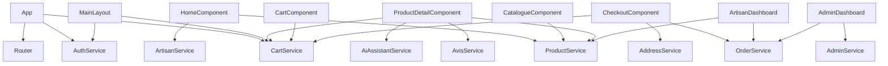

# Cahier technique frontend — Angular

## 1. Objet du document

Ce document décrit l'architecture technique complète du frontend Angular du projet Marketplace.
Il couvre la structure des fichiers, le système de routes, les composants, les services, les guards, l'intercepteur CSRF et le référencement SEO mis en place.

Périmètre : `marketplace/frontend/src/`

---

## 2. Stack technique

| Technologie | Rôle |
|---|---|
| Angular 17+ | Framework frontend SPA |
| TypeScript | Langage principal |
| Tailwind CSS | Styles utilitaires |
| Signals Angular (`signal`, `computed`) | Gestion d'état réactif local |
| RxJS | Flux HTTP et événements |
| Angular HttpClient | Communication avec le backend PHP |

Build : `npm run build` dans `frontend/` → sortie dans `public/app/browser/`

---

## 3. Structure des dossiers

```
frontend/src/app/
├── app.ts                   # Composant racine + gestion SEO
├── app.config.ts            # Configuration de l'application (providers)
├── app.routes.ts            # Déclaration de toutes les routes
│
├── core/
│   ├── guards/              # Contrôle d'accès aux routes
│   │   ├── auth.guard.ts    # Redirige vers /login si non connecté
│   │   └── role.guard.ts    # Redirige selon le rôle (admin=1, artisan=2, client=3)
│   ├── interceptors/
│   │   └── csrf.interceptor.ts  # Ajoute X-CSRF-Token sur toutes les mutations HTTP
│   ├── models/
│   │   └── models.ts        # Interfaces TypeScript (Produit, Commande, Artisan...)
│   ├── services/            # Communication avec l'API backend
│   └── utils/
│       └── image-path.ts    # Résolution des chemins d'images produit
│
├── layouts/                 # Gabarits de page selon le contexte
│   ├── main-layout/         # Layout public (header + footer + nav visiteur)
│   ├── artisan-layout/      # Layout espace artisan (sidebar + navigation artisan)
│   └── admin-layout/        # Layout espace admin (sidebar + navigation admin)
│
├── pages/                   # Pages de l'application (lazy loaded)
│   ├── home/                # Page d'accueil
│   ├── catalogue/           # Catalogue avec filtres
│   ├── product-detail/      # Fiche produit
│   ├── cart/                # Panier
│   ├── checkout/            # Passage de commande
│   ├── artisan-shop/        # Boutique d'un artisan
│   ├── profile/             # Profil utilisateur connecté
│   ├── auth/login/          # Connexion
│   ├── auth/register/       # Inscription
│   ├── artisan/             # Espace artisan (dashboard, produits, commandes, stats)
│   ├── admin/               # Espace admin (dashboard, artisans, clients, commandes...)
│   └── not-found/           # Page 404
│
└── shared/                  # Composants réutilisables
    ├── product-card/        # Carte produit (affiché dans home + catalogue)
    ├── kpi-card/            # Carte indicateur (dashboard artisan/admin)
    ├── ai-assistant/        # Composant assistant IA Ollama
    └── toast-container/     # Notifications système
```

---

## 4. Système de routes

### 4.1 Principe : lazy loading

Toutes les pages et layouts sont chargés à la demande (`loadComponent`). Angular ne télécharge le code d'une page que lorsqu'elle est visitée. Cela réduit la taille du bundle initial et accélère le premier chargement.

```ts
// Exemple : la page catalogue n'est chargée que quand l'utilisateur navigue vers /catalogue
{
  path: 'catalogue',
  loadComponent: () => import('./pages/catalogue/catalogue.component').then(m => m.CatalogueComponent),
}
```

### 4.2 Structure des routes (app.routes.ts)

```
/                   → redirige vers /home

/login              → LoginComponent          (chargement lazy)
/register           → RegisterComponent       (chargement lazy)

/ (MainLayout)      → MainLayoutComponent     (chargement lazy)
  /home             → HomeComponent
  /catalogue        → CatalogueComponent
  /produit/:id      → ProductDetailComponent
  /panier           → CartComponent
  /profil           → ProfileComponent        [authGuard]
  /commande         → CheckoutComponent       [authGuard]
  /boutique/:id     → ArtisanShopComponent

/artisan            → ArtisanLayoutComponent  [roleGuard(2)]
  /artisan/dashboard
  /artisan/produits
  /artisan/commandes
  /artisan/stats
  /artisan/stats/consultation-produits

/admin              → AdminLayoutComponent    [roleGuard(1)]
  /admin/dashboard
  /admin/artisans
  /admin/clients
  /admin/administrateurs
  /admin/commandes
  /admin/produits

/**                 → NotFoundComponent (404)
```

### 4.3 Guards

Les guards sont des fonctions qui s'exécutent avant l'affichage d'une page pour vérifier si l'utilisateur a le droit d'y accéder.

**`authGuard`** — vérifie que l'utilisateur est connecté :
```ts
export const authGuard: CanActivateFn = () => {
  const auth = inject(AuthService);
  if (auth.isLoggedIn()) return true;
  return router.createUrlTree(['/login']); // redirige sinon
};
```

**`roleGuard(role)`** — vérifie le rôle. Retourne une fonction paramétrée par le rôle requis :
```ts
export const roleGuard = (role: number): CanActivateFn => () => {
  const user = auth.currentUser();
  if (!user) return router.createUrlTree(['/login']);      // pas connecté
  if (user.id_role === role || user.id_role === 1) return true; // admin passe partout
  return router.createUrlTree(['/']);                      // mauvais rôle
};
```

Rôles : `1` = admin, `2` = artisan, `3` = client.

---

## 5. Layouts

Un layout est un composant "enveloppe" qui contient le menu, la barre latérale et un `<router-outlet>` pour afficher la page active.

| Layout | Chemin | Contexte |
|---|---|---|
| `MainLayoutComponent` | `/layouts/main-layout/` | Visiteur et client : header avec logo, nav publique, footer |
| `ArtisanLayoutComponent` | `/layouts/artisan-layout/` | Artisan : sidebar avec liens vers ses fonctions (produits, commandes, stats) |
| `AdminLayoutComponent` | `/layouts/admin-layout/` | Admin : sidebar avec tous les modules de gestion |

---

## 6. Services

Les services sont des classes injectées qui encapsulent la communication HTTP avec le backend PHP.

| Service | Fichier | Rôle |
|---|---|---|
| `AuthService` | `auth.service.ts` | Login, logout, profil, état de connexion (Signal `currentUser`) |
| `ProductService` | `product.service.ts` | Catalogue, produits artisan, catégories |
| `OrderService` | `order.service.ts` | Commandes client, artisan, admin (3 endpoints différents par rôle) |
| `CartService` | `cart.service.ts` | Panier : chargement, ajout, modification, suppression |
| `ArtisanService` | `artisan.service.ts` | Liste des artisans, boutique publique |
| `AdminService` | `admin.service.ts` | Gestion utilisateurs, artisans, produits côté admin |
| `AiAssistantService` | `ai-assistant.service.ts` | Appels vers l'endpoint IA (`/api/ai/chat`) |
| `AddressService` | `address.service.ts` | Adresses utilisateur |
| `AvisService` | `avis.service.ts` | Avis sur les produits |
| `ToastService` | `toast.service.ts` | Notifications visuelles (succès, erreur) |

---

## 7. Intercepteur CSRF

L'intercepteur `csrfInterceptor` est appliqué globalement à tous les appels HTTP (`app.config.ts`).

**Son rôle :** sur chaque réponse HTTP, il lit le header `X-CSRF-Token` renvoyé par le backend PHP et le mémorise. Sur chaque requête mutante (POST, PUT, PATCH, DELETE), il ajoute ce token en header.

```ts
// Lecture du token depuis les réponses
const nextToken = event.headers.get('X-CSRF-Token');
if (nextToken) csrfToken = nextToken;

// Ajout sur les requêtes mutantes
if (isApiCall && isMutating && req.withCredentials && csrfToken) {
  request = req.clone({ setHeaders: { 'X-CSRF-Token': csrfToken } });
}
```

Cela protège contre les attaques CSRF : un site malveillant qui tenterait d'envoyer une requête à la place de l'utilisateur ne posséderait pas ce token.

---

## 8. Gestion d'état avec les Signals

Angular 17+ introduit les Signals comme alternative à RxJS pour la gestion d'état local dans les composants.

**Signal** = une valeur réactive. Quand elle change, Angular re-rend uniquement les parties du template qui en dépendent.

**`computed()`** = une valeur calculée automatiquement à partir d'autres signals. Elle se recalcule uniquement quand ses dépendances changent.

Exemple dans le catalogue :
```ts
search           = signal('');          // valeur d'entrée
selectedCategory = signal('');          // filtre catégorie
maxPrice         = signal(200);         // filtre prix

// computed recalcule filtered() chaque fois que l'un des signals ci-dessus change
filtered = computed(() => {
  let result = this.all().filter(p => p.actif);
  if (this.search()) result = result.filter(p => p.nom.includes(this.search()));
  if (this.selectedCategory()) result = result.filter(p => p.categorie === this.slugify(...));
  return result;
});
```

---

## 9. Configuration de l'application

**`app.config.ts`** déclare les providers globaux :
```ts
export const appConfig = {
  providers: [
    provideZoneChangeDetection({ eventCoalescing: true }),
    provideRouter(routes),
    provideHttpClient(withFetch(), withInterceptors([csrfInterceptor])),
  ],
};
```

- `provideRouter(routes)` : active le routing Angular avec la configuration définie dans `app.routes.ts`
- `provideHttpClient(withInterceptors([csrfInterceptor]))` : active le client HTTP avec l'intercepteur CSRF branché

---

## 10. Composant racine et SEO

**`app.ts`** est le composant racine, chargé en premier. Il contient deux responsabilités :

1. **Chargement du profil** : dès le démarrage, il appelle `auth.loadProfile()` pour vérifier si l'utilisateur est connecté (cookie de session), et si oui charge le panier.

2. **Mise à jour SEO** : à chaque changement de route, il lit les données SEO déclarées dans `app.routes.ts` (`title`, `description`) et met à jour :
   - le titre de l'onglet (`<title>`)
   - la balise `<meta name="description">`
   - les balises Open Graph (`og:title`, `og:description`, `og:url`)
   - les balises Twitter Card
   - l'URL canonique (`<link rel="canonical">`)

---

## 11. Modèles de données TypeScript

Le fichier `models.ts` définit les interfaces qui correspondent aux données renvoyées par le backend PHP.

Interfaces principales :
- `Utilisateur` : id_utilisateur, email, prenom, nom, id_role
- `Artisan` : id_artisan, nom_boutique, description, id_utilisateur
- `Produit` : id_produit, nom, description, prix_ht, stock, actif, mis_en_avant, categorie
- `Categorie` : id_categorie, nom, slug
- `Commande` : id_commande, reference, statut, total_ttc, date_commande
- `LigneCommande` : id_ligne, id_commande, id_produit, quantite, prix_unitaire_ht, taux_tva
- `Panier` : items (PanierItem[]), total
- `Adresse` : rue, code_postal, ville, type (livraison | facturation)

Constantes :
- `CATEGORY_LABELS` : mapping slug → label lisible (ex : `miels` → `Miels`)
- `STATUT_LABELS` : mapping statut commande → libellé (ex : `en_attente` → `En attente`)

---

## 12. Diagramme des dépendances



---

## 13. Variables d'environnement

**`src/environments/environment.ts`** (développement) :
```ts
export const environment = {
  production: false,
  apiUrl: '/project02',
};
```

**`src/environments/environment.prod.ts`** (production) :
```ts
export const environment = {
  production: true,
  apiUrl: 'https://bacinfo.eci-liege.info/project02',
};
```

Le build de production substitue automatiquement le fichier d'environnement.
