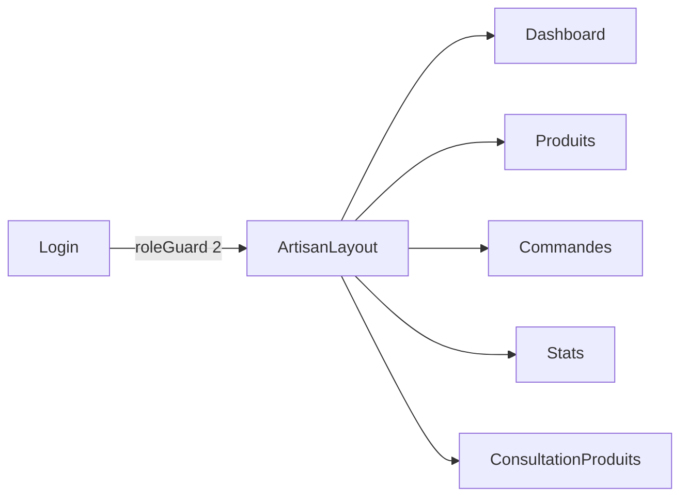
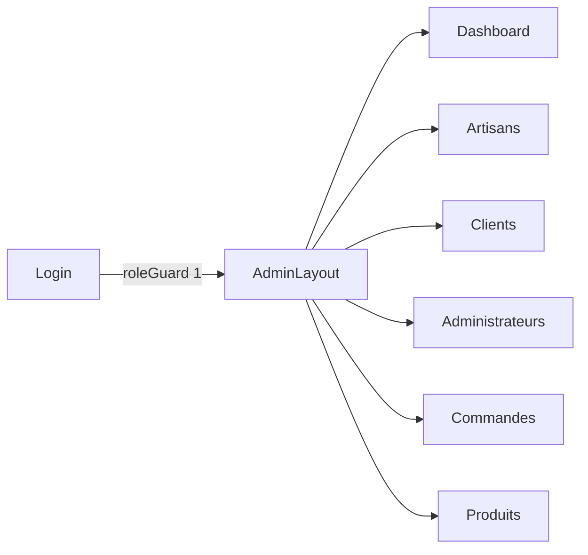

# Parcours de navigation dans l'application

## 1. Objet du document

Ce document décrit, de façon concrète et lisible, comment un utilisateur navigue dans l'application Marketplace selon son profil (visiteur, client, artisan, administrateur).

Il couvre le chemin technique (routes, composants) et la logique de chaque étape.

---

## 2. Parcours visiteur anonyme — De l'accueil à la commande

### Étape 1 — Arrivée sur le site

L'utilisateur arrive sur l'URL racine `/`. Angular redirige automatiquement vers `/home`.

**Route :** `/ → /home`
**Composant :** `HomeComponent` dans le `MainLayoutComponent`

La page d'accueil affiche :
- une section héros avec un lien vers le catalogue
- les catégories de produits
- les produits mis en avant (filtrés avec `p.mis_en_avant && p.actif`)
- les boutiques des artisans
- une section de réassurance

```
GET /project02/products       → liste tous les produits actifs
GET /project02/artisans       → liste les artisans
```

---

### Étape 2 — Navigation vers le catalogue

L'utilisateur clique sur une catégorie ou sur « Explorer le catalogue ».

**Route :** `/catalogue` ou `/catalogue?category=Miels`
**Composant :** `CatalogueComponent`

Le composant charge deux listes au démarrage :
```
GET /project02/api/categories → liste des catégories
GET /project02/products       → liste tous les produits actifs
```

Les filtres fonctionnent entièrement côté navigateur via les Signals Angular : aucune requête supplémentaire n'est envoyée au serveur quand on filtre ou trie.

**Filtres disponibles :**
- Catégorie : boutons radio (desktop) ou panneau accordéon (mobile)
- Prix maximum : curseur de 0 à 200€
- Recherche texte : champ de saisie
- Tri : pertinence, prix croissant/décroissant, nouveautés

**Filtre par catégorie depuis la page d'accueil :**
La home passe `?category=Miels` (libellé lisible). Le catalogue lit ce paramètre, le convertit en slug via `slugify()` et le compare au slug stocké côté backend, résolvant ainsi le problème d'accents (ex : `Céramiques` → `ceramiques`).

---

### Étape 3 — Consultation d'une fiche produit

L'utilisateur clique sur un produit.

**Route :** `/produit/:id`
**Composant :** `ProductDetailComponent`

La page charge :
```
GET /project02/products/:id     → détails du produit
GET /project02/api/produits/:id/avis → avis sur le produit
```

L'utilisateur peut :
- consulter les photos, la description, le prix
- lire les avis
- ajouter au panier (POST `/project02/cart`)
- utiliser l'assistant IA pour poser une question sur le produit

**Note :** le panier fonctionne en session PHP anonyme. L'utilisateur n'a pas besoin d'être connecté pour ajouter un produit au panier.

---

### Étape 4 — Consultation du panier

**Route :** `/panier`
**Composant :** `CartComponent`

```
GET /project02/cart → état du panier courant
```

L'utilisateur peut modifier les quantités ou supprimer des articles.

Pour passer à la commande, il est redirigé vers `/login` s'il n'est pas connecté (authGuard sur `/commande`).

---

### Étape 5 — Connexion

**Route :** `/login`
**Composant :** `LoginComponent`

```
POST /project02/login  → crée la session PHP + renvoie X-CSRF-Token
```

Après connexion réussie :
- `AuthService` met à jour le signal `currentUser` avec les infos du profil
- L'intercepteur CSRF mémorise le token reçu en header
- L'utilisateur est redirigé vers `/commande`

---

### Étape 6 — Passage de la commande

**Route :** `/commande` (protégée par `authGuard`)
**Composant :** `CheckoutComponent`

```
GET  /project02/api/user-addresses → adresses enregistrées de l'utilisateur
GET  /project02/cart               → résumé du panier
POST /project02/orders             → création de la commande
```

L'utilisateur sélectionne une adresse de livraison et confirme. La commande est créée avec toutes ses lignes dans une transaction atomique côté backend.

---

## 3. Schéma du parcours visiteur

```mermaid
flowchart TD
  A[Arrivée sur /] --> B[/home]
  B --> C{Clic catégorie ou Catalogue}
  C --> D[/catalogue ?category=X]
  D --> E{Clic produit}
  E --> F[/produit/:id]
  F --> G{Ajoute au panier}
  G --> H[/panier]
  H --> I{Passer commande}
  I --> J{Connecté ?}
  J -- Non --> K[/login]
  K --> L[/commande]
  J -- Oui --> L
  L --> M[Commande créée]
```

---

## 4. Parcours artisan

L'artisan se connecte via `/login`. Si son rôle est `2`, le `roleGuard(2)` lui autorise l'accès aux routes `/artisan/*`.

**Layout :** `ArtisanLayoutComponent` avec une sidebar de navigation.

### Pages disponibles

| Route | Page | Données |
|---|---|---|
| `/artisan/dashboard` | Vue d'ensemble | Commandes récentes + top produits par stock |
| `/artisan/produits` | Gestion des produits | CRUD produits, images, activation/désactivation |
| `/artisan/commandes` | Commandes reçues | `GET /project02/artisan/orders` |
| `/artisan/stats` | Statistiques | CA total, panier moyen, répartition des statuts |
| `/artisan/stats/consultation-produits` | Visites produits | Suivi des consultations par produit |



---

## 5. Parcours administrateur

L'administrateur se connecte via `/login`. Si son rôle est `1`, le `roleGuard(1)` lui ouvre l'accès. L'admin a aussi accès aux espaces artisans (le guard autorise le rôle 1 dans tous les roleGuard).

**Layout :** `AdminLayoutComponent` avec une sidebar complète.

### Pages disponibles

| Route | Page | Données |
|---|---|---|
| `/admin/dashboard` | Vue d'ensemble | KPIs globaux : CA, commandes, utilisateurs actifs |
| `/admin/artisans` | Gestion artisans | Créer, modifier, désactiver un compte artisan |
| `/admin/clients` | Gestion clients | Voir, modifier, désactiver un compte client |
| `/admin/administrateurs` | Gestion admins | Gestion des comptes administrateurs |
| `/admin/commandes` | Toutes les commandes | `GET /project02/admin/orders` + changement de statut |
| `/admin/produits` | Tous les produits | Vue globale + désactivation produit |



---

## 6. Mécanisme de protection des routes

```mermaid
flowchart TD
  Route --> Guard{Guard défini ?}
  Guard -- Non --> Affiche
  Guard -- authGuard --> ConnectéCheck{Utilisateur connecté ?}
  ConnectéCheck -- Oui --> Affiche
  ConnectéCheck -- Non --> Login[/login]
  Guard -- roleGuard n --> RoleCheck{role === n ou admin ?}
  RoleCheck -- Oui --> Affiche
  RoleCheck -- Non connecté --> Login
  RoleCheck -- Mauvais rôle --> Accueil[/home]
```

---

## 7. Déconnexion

Disponible depuis le header (MainLayout) ou depuis la sidebar artisan/admin.

```
POST /project02/logout
```

`AuthService.logout()` envoie la requête, puis vide systématiquement `currentUser` même en cas d'erreur réseau (grâce à `catchError`). Le signal `currentUser` est remis à `null`, ce qui met à jour immédiatement le header (affichage du bouton « Connexion » à la place du menu utilisateur).

---

## 8. Gestion du panier en temps réel

Le `CartService` expose un signal `items` accessible depuis le header. Lorsqu'un produit est ajouté, le header se met à jour instantanément sans rechargement de page. Cela utilise le système de Signals Angular 17+ : le compteur de produits dans la navigation est un `computed()` dérivé du signal `items`.
